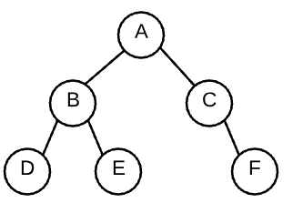

## Binary Tree  

`graph` is a collection of nodes (circles) and any edges (arrows) between those nodes

- a tree is a graph that does not contain any cycles  
  - a cycle is defined as a path thru edges that begins and the same node  

`binary tree` is a tree where nodes have at most 2 children  
there exists `ternary trees` (at most 3 kids) and `n-ary trees` (at most n kids)

- an empty gaph of 2 nodes and 0 edges is a binary tree
- a graph of 1 node and 0 edges is a binary tree
- a linked list is a binary tree  

**Basic Tree Terminology**  
`tree` - graph with no cycles  
`binary tree` - tree where nodes have at most 2 nodes  
`root` - the ultimate parent, the single node of a tree that can access every other node through edges; by definition the root will not have a parent  
`internal node` - a node that has children  
`leaf` - a node that does not have any children  
`path` - a series of nodes that can be traveled through edges - for example A, B, E is a path through the above tree  

---
## DFS and BFS

- `B` and `C` are siblings
- `D` and `E` are descendants of `B`
- `B`, `C`, `D`, `E`, `F` are all descendants of `A`

## Depth First Search  

A depth-first traversal will continually travel deeper into a tree before switching branches.  
DFS utilizes a `stack`, or `LIFO`

## Breadth First Search

- level 0 contains `A`
- level 1 contains `B` and `C`
- level 2 contains `D`, `E`, `F`

A Breadth-First traversal will visit all nodes across a level (or all node siblings), before moving to the next level.  
BFS utilizes a `queue`, or `FIFO`