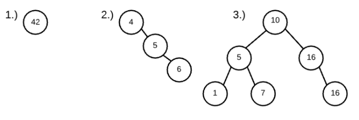
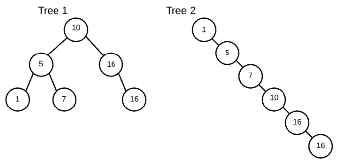

## Binary Tree  

`graph` is a collection of nodes (circles) and any edges (arrows) between those nodes

- a tree is a graph that does not contain any cycles  
  - a cycle is defined as a path thru edges that begins and the same node  

`binary tree` is a tree where nodes have at most 2 children  
there exists `ternary trees` (at most 3 kids) and `n-ary trees` (at most n kids)

- an empty gaph of 2 nodes and 0 edges is a binary tree
- a graph of 1 node and 0 edges is a binary tree
- a linked list is a binary tree  


**Basic Tree Terminology**  
`tree` - graph with no cycles  
`binary tree` - tree where nodes have at most 2 nodes  
`root` - the ultimate parent, the single node of a tree that can access every other node through edges; by definition the root will not have a parent  
`internal node` - a node that has children  
`leaf` - a node that does not have any children  
`path` - a series of nodes that can be traveled through edges - for example A, B, E is a path through the above tree  

---
## Inorder Preorder Postorder  
- print all nodes of the tree  

### In-Order 
- the steps for inOrderPrint: 
  - print all nodes in the left subtree
  - print root
  - print all nodes in the right subtree  
- in-order has the pattern of left, self right  
  - a node can only be printed once its left subtree has been completely printed
  - a node's right subtree can only be printed once the node itself has been printed

```javascript
function inOrderPrint(root) {
  if (!root) return;

  inOrderPrint(root.left);
  console.log(root.val);
  inOrderPrint(root.right);
}
```

### Pre-Order  
- the steps for preOrderPrint:
  - print root
  - print all nodes in the seft subtree
  - print all nodes in the right subtree
- pre-order has the pattern of self, left, right
  - a node must be printed before its children
  - a node's left subtree must be printed before its right subtree

```javascript
function preOrderPrint(root) {
  if (!root) return;

  console.log(root.val);
  preOrderPrint(root.left);
  preOrderPrint(root.right);
}
```

### Post-Order 
- the steps for postOrderPrint:
  - print all nodes in the left subtree
  - print all nodes in the right subtree
  - print root
- post-order has the pattern of left, right, self
  - a node can only be printed after its left and right subtrees
  - a node's left subtree is pritned before its right subtree  

```javascript
function postOrderPrint(root) {
    if (!root) return;

    postOrderPrint(root.left);
    postOrderPrint(root.right);
    console.log(root.val);
}
```
---
## DFS and BFS

- `B` and `C` are siblings
- `D` and `E` are descendants of `B`
- `B`, `C`, `D`, `E`, `F` are all descendants of `A`

## Depth First Search  

A depth-first traversal will continually travel deeper into a tree before switching branches.  
DFS utilizes a `stack`, or `LIFO`

## Breadth First Search

- level 0 contains `A`
- level 1 contains `B` and `C`
- level 2 contains `D`, `E`, `F`

A Breadth-First traversal will visit all nodes across a level (or all node siblings), before moving to the next level.  
BFS utilizes a `queue`, or `FIFO`

---
## Binary Search Tree / BST

### BST criteria
- given any node of the tree, the values in the left subtree must all be strictly less than the given node's value
- and the values in the right subtree must all be greater than or equal to the given node's value

### BST definition
- a `binary tree` is a `binary search tree` if:
  - the left subtree contains values less than the root
  - AND the right subtree contains values greater than or equal to the root
  - AND the left subtree is a BST
  - AND the right subtree is a BST
- an empty tree (a tree with 0 nodes) IS a BST
  - base case  

Examples of binary search trees:  
  

`Binary Search Trees` utilize the inOrder algo  
```javascript
function inOrderPrint(root) {
  if (!root) return;

  inOrderPrint(root.left);
  console.log(root.val);
  inOrderPrint(root.right);
}
```

BST 1: 42  
BST 2: 4, 5, 6  
BST 3: 1, 5, 7, 10, 16, 16  

### Example
```javascript
class TreeNode {
  constructor(val) {
    this.val = val;
    this.left = null;
    this.right = null;
  }
}

class BST {
  constructor() {
    this.root = null;
  }

  insert(val, root = this.root) {
    if (!this.root) {
      this.root = new TreeNode(val);
      return;
    }

    if (val < root.val) {
      if (!root.left) {
        root.left = new TreeNode(val);
      } else {
        this.insert(val, root.left);
      }
    } else {
      if (!root.right) {
        root.right = new TreeNode(val);
      } else {
        this.insert(val, root.right);
      }
    }
  }
}

let tree1 = new BST();
tree1.insert(10);
tree1.insert(5);
tree1.insert(16);
tree1.insert(1);
tree1.insert(7);
tree1.insert(16);

let tree2 = new BST();
tree2.insert(1);
tree2.insert(5);
tree2.insert(7);
tree2.insert(10);
tree2.insert(16);
tree2.insert(16);
```

  

- a worst case BST degenerates into a linked list
- the 'best' BSTs are height balanced 